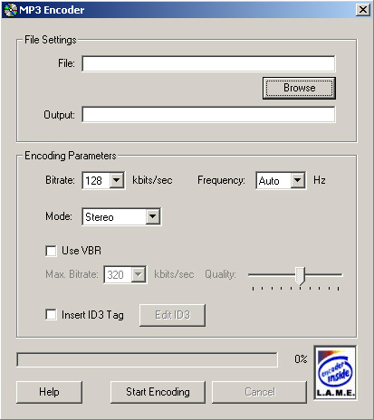



## Visual Basic MP3 Encoder using L\.A\.M\.E\.

### Description

This VB project enables you to convert Waveform audio (WAV) files into MP3 files using the free LAME encoding engine (http://www.mp3dev.com). The LAME API is utilized by the program using a special wrapup DLL written in Visual C++ (Much like Morphyx) that enables Visual Basic to use the LAME engine. This program supports VBR encoding, adjustable bitrates (30-320 KHz), sampling rates, and different encoding modes (Mono, Stereo, Joint Stereo, etc.)

If the program doesn't work copy the two dlls (lame_enc.dll and mp3enc.dll) to your "[windows dir]\system" folder.
 
### More Info
 
This program MIGHT work in VB 5.0, haven't tested it yet...

             |
---                |---
**Submitted On**   |2002-03-26 01:54:12
**By**             |[JVT](https://github.com/Planet-Source-Code/PSCIndex/blob/master/ByAuthor/jvt.md)
**Level**          |Advanced
**User Rating**    |3.8 (38 globes from 10 users)
**Compatibility**  |VB 6\.0
**Category**       |[Sound/MP3](https://github.com/Planet-Source-Code/PSCIndex/blob/master/ByCategory/sound-mp3__1-45.md)
**World**          |[Visual Basic](https://github.com/Planet-Source-Code/PSCIndex/blob/master/ByWorld/visual-basic.md)
**Archive File**   |[Visual\_Bas650563242002\.zip](https://github.com/Planet-Source-Code/jvt-visual-basic-mp3-encoder-using-l-a-m-e__1-33025/archive/master.zip)

